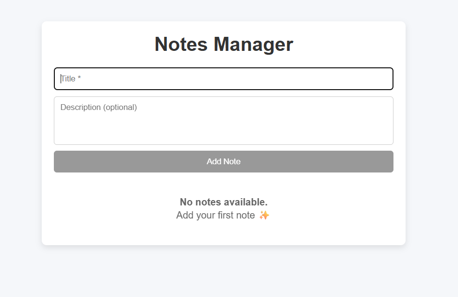
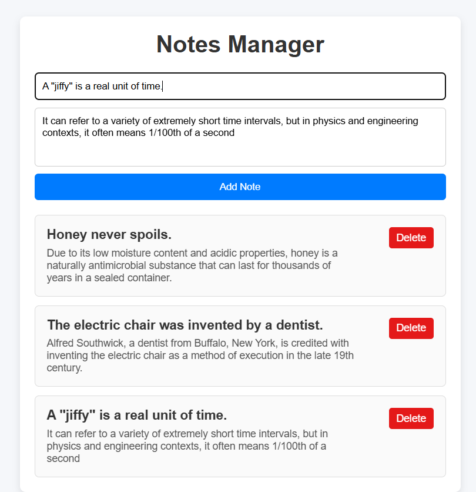
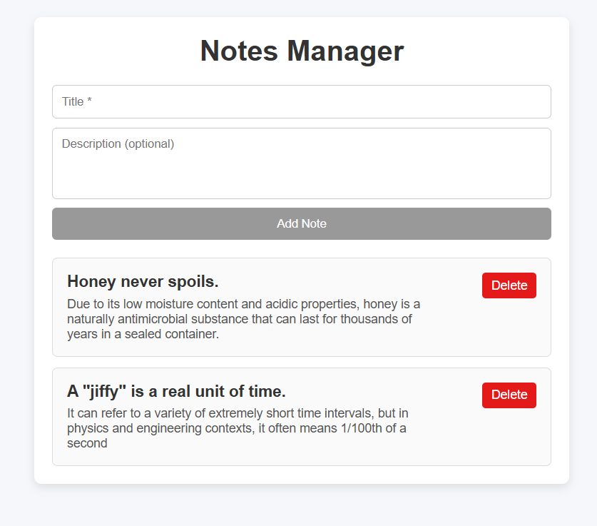

# Note Management App (React)

## **Project Overview**
Notes Manager is a simple and focused React application that allows users to create, view, and delete notes. The primary objective of this project is to demonstrate clean component architecture, effective state management using React hooks, and thoughtful handling of common UI states such as loading, empty, and validation scenarios. The application intentionally avoids overengineering to reflect real-world frontend development practices.

---

## **How to Run the Project**
<code>
### **Prerequisites**
- Node.js (version 16 or higher recommended)
- npm package manager

### **Steps**

# Install dependencies
npm install

# Start development server
npm run dev
</code>
The application will be available at:
http://localhost:5173

## Screenshots

### Disabled Button State

### Note Insertion

### Note Deletion

##Component Breakdown
###App

Root component of the application

Acts as the single source of truth

###Manages global state:

notes

loading

###Handles core business logic:

Adding notes

Deleting notes

###Controls conditional rendering for:

Loading state

Empty state

Notes list

Passes data and callback functions to child components via props

NoteForm

Handles creation of new notes

Manages local form state (title and description)

###Performs inline validation:

Ensures the title field is not empty

###On successful submission:

Sends note data to App using a callback

Resets form fields

NoteList

Responsible only for rendering the list of notes

Receives notes array from App via props

Iterates over notes and renders a NoteItem for each entry

Keeps list rendering logic isolated from business logic

NoteItem

Represents a single note entity

Displays:

Note title

Note description

Provides delete functionality

Triggers a delete callback to notify App when a note should be removed

Loader

Displays a loading indicator

Rendered while the application simulates data fetching

Improves perceived performance and user feedback

EmptyState

Displayed when no notes are present

Provides a clear and user-friendly message

Prevents an empty or confusing UI when the notes list is empty

#State Management Explanation

All application state is managed centrally within App.jsx using React’s useState hook. State is lifted to the lowest common ancestor to avoid duplication and ensure consistency across components.

Data flows downward from the parent component to child components through props, while user interactions such as adding or deleting notes propagate upward through callback functions. This unidirectional data flow ensures predictable state updates and simplifies debugging.

#Data Flow Examples

Add Note: NoteForm → App → NoteList

Delete Note: NoteItem → App → UI updates immediately

This approach guarantees:

Predictable application behavior

No duplicated or conflicting state

Clear separation of concerns

#UI States Handled

The application explicitly accounts for common UI scenarios to improve usability and robustness:

Loading State: Simulated using useEffect and setTimeout

Empty State: Displayed when no notes exist

Error State: Inline validation prevents note creation when the title field is empty

Assumptions and Limitations

No backend or database integration; all data is stored in memory

Notes do not persist after a page refresh

Authentication and authorization are not included

Styling is intentionally minimal to prioritize clarity, logic, and maintainability

#Technology Stack

React JS

Vite

JavaScript (ES6+)

CSS with component-scoped styling
